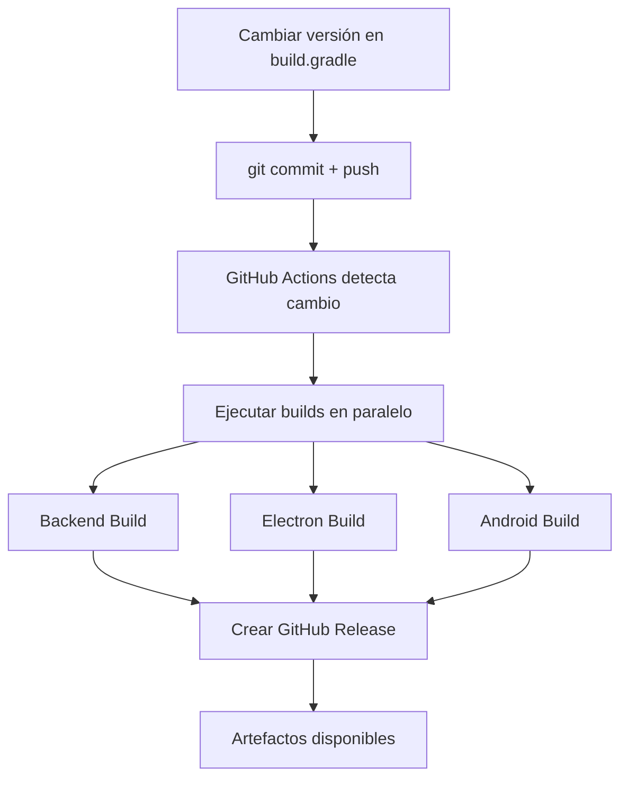

# 🚀 Sistema de Builds Automáticos

Este sistema detecta automáticamente cambios en la versión del proyecto y ejecuta builds para todas las plataformas.

## 📋 Cómo Funciona

### 1. Detección de Cambios
El sistema monitorea cambios en la línea de versión del archivo `build.gradle`:
```gradle
version = '1.0.0'  // ← Esta línea
```

### 2. Triggers Automáticos
Cuando se detecta un cambio de versión, se ejecutan automáticamente:

- **✅ Backend Build**: JAR de Spring Boot + Instalador MSI de Windows
- **✅ Electron Build**: Aplicaciones de escritorio (Windows, macOS, Linux)
- **✅ Android Build**: APKs debug y release

### 3. Artefactos Generados
Los builds generan los siguientes archivos:

```
📦 Backend:
├── discord-bot-manager-{version}-fat.jar     # JAR ejecutable
└── discord-bot-{version}.msi                 # Instalador Windows

📦 Electron (por cada OS):
├── Discord Bot Manager Setup {version}.exe   # Windows
├── Discord Bot Manager-{version}.dmg         # macOS  
└── Discord Bot Manager-{version}.AppImage    # Linux

📦 Android:
├── app-debug.apk                            # Para testing
└── app-release.apk                          # Para distribución
```

## 🔧 Configuración de GitHub Actions

### Workflows Incluidos

1. **`version-detector.yml`**: Detecta cambios en la versión
2. **`build-on-version-change.yml`**: Ejecuta todos los builds

### Variables de Entorno Requeridas

```yaml
env:
  JAVA_VERSION: '17'      # Para el backend
  NODE_VERSION: '18'      # Para Electron y Android
```

### Secretos de GitHub (Opcionales)

Para funcionalidades avanzadas, puedes configurar:

```
GITHUB_TOKEN         # Auto-configurado por GitHub
DISCORD_WEBHOOK      # Para notificaciones a Discord (opcional)
```

## 🎯 Uso Práctico

### Para Activar un Build Completo:

1. **Edita la versión** en `build.gradle`:
   ```gradle
   version = '1.0.1'  // Cambia solo esto
   ```

2. **Haz commit y push**:
   ```bash
   git add build.gradle
   git commit -m "🚀 Bump version to 1.0.1"
   git push
   ```

3. **¡Los builds se ejecutan automáticamente!** 🎉

### Para Testing Local:

Usa los scripts incluidos para verificar si tus cambios activarían los builds:

```bash
# En Linux/macOS:
./check-version-change.sh

# En Windows (PowerShell):
.\check-version-change.ps1
```

## 📋 Flujo Completo



## 🚀 Ventajas

- **✅ Automático**: Sin intervención manual
- **✅ Paralelo**: Todos los builds se ejecutan simultáneamente
- **✅ Versionado**: Release automático con los artefactos
- **✅ Multi-plataforma**: Windows, macOS, Linux, Android
- **✅ Detección inteligente**: Solo cuando cambia la versión

## 🔧 Personalización

### Cambiar las Plataformas de Build

Edita `.github/workflows/build-on-version-change.yml`:

```yaml
# Para agregar más plataformas de Electron:
strategy:
  matrix:
    os: [windows-latest, ubuntu-latest, macos-latest, macos-11]

# Para cambiar la versión de Android SDK:
- name: Configurar Android SDK
  uses: android-actions/setup-android@v3
  with:
    api-level: 34  # Cambiar aquí
```

### Agregar Notificaciones

Para recibir notificaciones en Discord cuando se complete un build:

1. Crea un webhook en tu servidor de Discord
2. Añade el secret `DISCORD_WEBHOOK` en GitHub
3. Agrega este step al final del workflow:

```yaml
- name: Notificar a Discord
  if: success()
  run: |
    curl -H "Content-Type: application/json" \
         -d '{"content":"🚀 Build v${{ needs.detect-version-change.outputs.new-version }} completado!"}' \
         ${{ secrets.DISCORD_WEBHOOK }}
```

## 🐛 Troubleshooting

### El build no se ejecuta automáticamente

1. Verifica que cambiaste la línea exacta: `version = '...'`
2. Asegúrate de hacer push a `main`, `master` o `develop`
3. Revisa los logs en la pestaña "Actions" de GitHub

### Builds fallan

1. **Backend**: Verifica que todas las dependencias estén en `build.gradle`
2. **Electron**: Confirma que `src/main/desktop/package.json` esté correcto
3. **Android**: Asegúrate de que el SDK de Android esté bien configurado

### Artefactos no se generan

Los artefactos se almacenan por 30 días. Si necesitas más tiempo:

```yaml
retention-days: 90  # Cambiar en cada upload-artifact
```

## 🎉 ¡Listo!

Con este sistema, cada vez que cambies la versión en `build.gradle`, obtendrás automáticamente builds frescos para todas las plataformas. ¡Perfecto para releases rápidos y testing!
