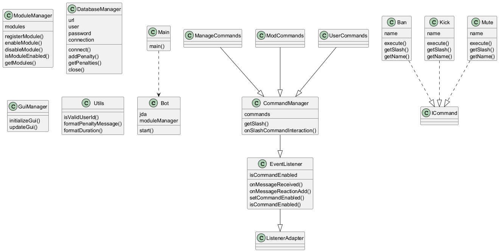

# Proyecto Discord Bot con JDA

Este proyecto es un bot de Discord desarrollado en Java utilizando la biblioteca JDA (Java Discord API). El bot está diseñado para ser modular y extensible, permitiendo la adición de nuevas funcionalidades y comandos de manera sencilla.

## Estructura del Proyecto

El proyecto está organizado de la siguiente manera:

```
Directory structure:
└── pelayops-discordbot_app/
    ├── README.md                # Archivo que contiene la documentación del proyecto.
    ├── LICENSE                  # Archivo que contiene la licencia del proyecto.
    ├── git-upload.bat           # Script para automatizar el proceso de commit y push a Git.
    ├── src/                     # Directorio que contiene el código fuente del proyecto.
    │   └── main/                # Directorio principal del código fuente.
    │       ├── java/            # Directorio que contiene el código fuente en Java.
    │       │   └── bot/         # Paquete principal del bot.
    │       │       ├── Bot.java             # Clase principal del bot.
    │       │       ├── Main.java            # Clase que contiene el método `main` para ejecutar el bot.
    │       │       ├── commands/            # Paquete que contiene las interfaces y clases relacionadas con los comandos del bot.
    │       │       │   ├── ICommand.java        # Interfaz para definir comandos.
    │       │       │   ├── ModuleManager.java    # Clase para gestionar los módulos de comandos.
    │       │       │   └── modules/              # Paquete que contiene las implementaciones de los comandos.
    │       │       │       ├── CommandManager.java    # Clase para gestionar los comandos.
    │       │       │       ├── ManageCommands.java    # Clase para gestionar comandos específicos.
    │       │       │       ├── ModCommands.java       # Clase para comandos de moderación.
    │       │       │       ├── UserCommands.java      # Clase para comandos de usuario.
    │       │       │       ├── mod/                   # Paquete que contiene comandos de moderación.
    │       │       │       │   ├── Ban.java               # Clase para el comando de banear usuarios.
    │       │       │       │   ├── Kick.java              # Clase para el comando de expulsar usuarios.
    │       │       │       │   └── Mute.java              # Clase para el comando de silenciar usuarios.
    │       │       │       └── user/                  # Paquete que contiene comandos de usuario.
    │       │       │           └── Avatar.java            # Clase para el comando de mostrar el avatar de un usuario.
    │       │       ├── database/            # Paquete que contiene clases relacionadas con la gestión de la base de datos.
    │       │       │   └── DatabaseManager.java    # Clase para gestionar la conexión y operaciones con la base de datos.
    │       │       ├── events/              # Paquete que contiene clases relacionadas con la gestión de eventos.
    │       │       │   └── EventListener.java    # Clase para escuchar y manejar eventos de Discord.
    │       │       ├── gui/                 # Paquete que contiene clases relacionadas con la interfaz gráfica de usuario.
    │       │       │   └── GuiManager.java    # Clase para gestionar la interfaz gráfica de usuario.
    │       │       └── utils/               # Paquete que contiene clases utilitarias.
    │       │           └── Utils.java    # Clase con métodos utilitarios.
    │       └── resources/            # Directorio que contiene recursos del proyecto.
    │           ├── config.properties    # Archivo de configuración del bot.
    │           └── logback.xml          # Archivo de configuración para el registro de logs.
    └── uml_output/              # Directorio que contiene los diagramas UML generados.
        ├── diagrama.puml    # Archivo fuente del diagrama UML.
        └── diagrama.png     # Imagen del diagrama UML.
```

## Instalación

1. Clona el repositorio en tu máquina local:
   ```sh
   git clone <URL_DEL_REPOSITORIO>
   ```

2. Navega al directorio del proyecto:
   ```sh
   cd discord-bot
   ```

3. Asegúrate de tener [Gradle](https://gradle.org/install/) instalado en tu sistema.

4. Ejecuta el siguiente comando para construir el proyecto:
   ```sh
   gradle build
   ```

5. Para generar el diagrama de clases UML, ejecuta el siguiente script con el argumento del path del proyecto:
   ```sh
   python uml.py <ruta_al_proyecto_java>
   ```

## Configuración

Antes de ejecutar el bot, asegúrate de configurar las credenciales y parámetros necesarios en el archivo `src/main/resources/config.properties`. Aquí hay un ejemplo de cómo debería verse el archivo:

```properties
# Configuración del bot de Discord
token=TU_TOKEN_DE_DISCORD
prefix=!

# Configuración de la base de datos
db.url=jdbc:mysql://localhost:3306/discordbot
db.username=root
db.password=contraseña
```

## Uso

Para ejecutar el bot, utiliza el siguiente comando:

```sh
gradle run
```

## Comandos Disponibles

El bot incluye los siguientes comandos por defecto:

- `/ban` - Banear a un usuario
- `/kick` - Expulsar a un usuario
- `/mute` - Silenciar a un usuario
- `/avatar` - Mostrar el avatar de un usuario

Puedes agregar más comandos según sea necesario en los módulos correspondientes.

## Contribuciones

Las contribuciones son bienvenidas. Si deseas agregar nuevas funcionalidades o mejorar el código, por favor abre un issue o un pull request.

## Licencia

Este proyecto está bajo la Licencia MIT. Consulta el archivo [LICENSE](./LICENSE) para más detalles.

## Contacto

Para cualquier consulta o soporte, puedes contactarnos a través de [correo electrónico](mailto:pelayops1041@gmail.com).

## Diagrama UML

A continuación se muestra un diagrama UML del proyecto:


