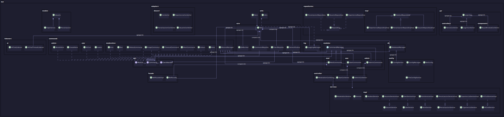

# DiscordBot_app


[](https://deepwiki.com/PelayoPS/DiscordBot_app)
---

## Tabla de Contenidos
- [Descripción](#descripción)
- [Arquitectura General](#arquitectura-general)
- [Requisitos Previos](#requisitos-previos)
- [Instalación](#instalación)
- [Uso](#uso)
- [Estructura del Proyecto](#estructura-del-proyecto)
- [Diagrama UML de Clases](#diagrama-uml-de-clases)
- [Contribución](#contribución)
- [Licencia](#licencia)

---

## Descripción
DiscordBot_app es una aplicación avanzada que integra un bot de Discord desarrollado en Java con Spring Boot, una interfaz gráfica de usuario (GUI) basada en Electron y una arquitectura modular y escalable. Permite la gestión de servidores, usuarios, roles, penalizaciones, experiencia y módulos personalizados, integrando funcionalidades de IA y administración avanzada.

## Arquitectura General
- **Backend:** Java 17+, Spring Boot, arquitectura por capas (controladores, servicios, repositorios, modelos).
- **Frontend:** Electron (HTML, CSS, JS), integración con backend vía API.
- **Persistencia:** JPA/Hibernate, base de datos relacional.
- **Modularidad:** Separación clara de paquetes por dominio y responsabilidad.
- **Seguridad:** Gestión de roles y permisos, autenticación y autorización.

## Requisitos Previos
- Java 17 o superior
- Node.js 16+ y npm (para Electron)
- Gradle 7+
- Base de datos compatible (ej. PostgreSQL, MySQL)

## Instalación
1. **Clonar el repositorio:**
   ```bash
   git clone https://github.com/pelay/DiscordBot_app.git
   cd DiscordBot_app
   ```
2. **Configurar variables y propiedades:**
   - Editar `src/main/resources/config.properties` para la configuración de la base de datos y el bot.
3. **Compilar backend:**
   ```bash
   ./gradlew build
   ```
4. **Instalar dependencias frontend:**
   ```bash
   cd electron-app
   npm install
   ```
5. **Ejecutar la aplicación:**
   - Backend: `./gradlew bootRun`
   - Frontend: `npm start` (desde `electron-app`)

## Uso
- Iniciar el backend y luego el frontend.
- Acceder a la GUI para autenticarse y gestionar el bot.
- Usar comandos de Discord según los permisos y módulos habilitados.

## Estructura del Proyecto
```
DiscordBot_app/
├── src/
│   ├── main/
│   │   ├── java/
│   │   │   └── bot/
│   │   │       ├── core/
│   │   │       ├── api/
│   │   │       ├── commands/
│   │   │       ├── modules/
│   │   │       ├── db/
│   │   │       ├── config/
│   │   │       ├── log/
│   │   │       ├── utils/
│   │   │       ├── facade/
│   │   │       ├── controller/
│   │   │       ├── listeners/
│   │   │       ├── gui/
│   │   │       ├── services/
│   │   │       ├── repositories/
│   │   │       ├── adapters/
│   │   │       └── models/
│   │   └── resources/
├── uml_output/
│   ├── diagrama_clases.puml
│   ├── use_cases.puml
│   └── ...
├── electron-app/
│   └── ...
├── build.gradle
├── settings.gradle
├── README.md
└── ...
```

## Diagrama UML de Clases
El diagrama de clases PlantUML se encuentra en `uml_output/diagrama_clases.puml` y representa la estructura de paquetes, clases principales y relaciones clave del sistema.


## Contribución
Las contribuciones son bienvenidas. Por favor, abre un issue o pull request siguiendo las buenas prácticas de GitHub.

## Licencia
Este proyecto está licenciado bajo la Licencia MIT. Consulta el archivo [LICENSE](LICENSE) para más detalles.